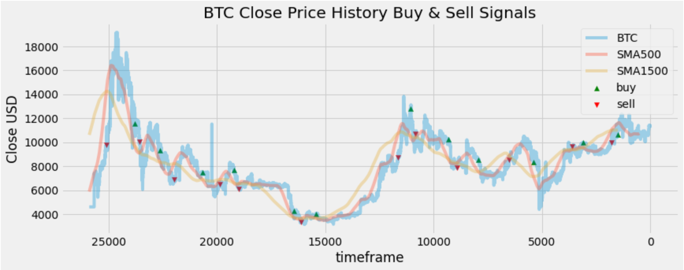

# Trade_Inidcator_Bot
Status:
This python programm uses a dual moving average crossover to determine when to buy and sell assets. 
Imput: chart data in .csv-format

# Preview:

# Vision
This project will create a bot that generates trade signals and posts them by notification to a telegram group
